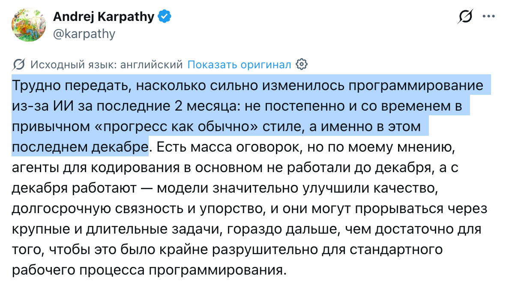
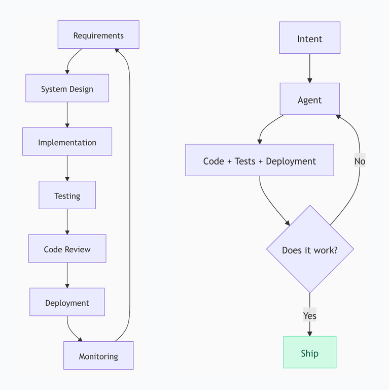
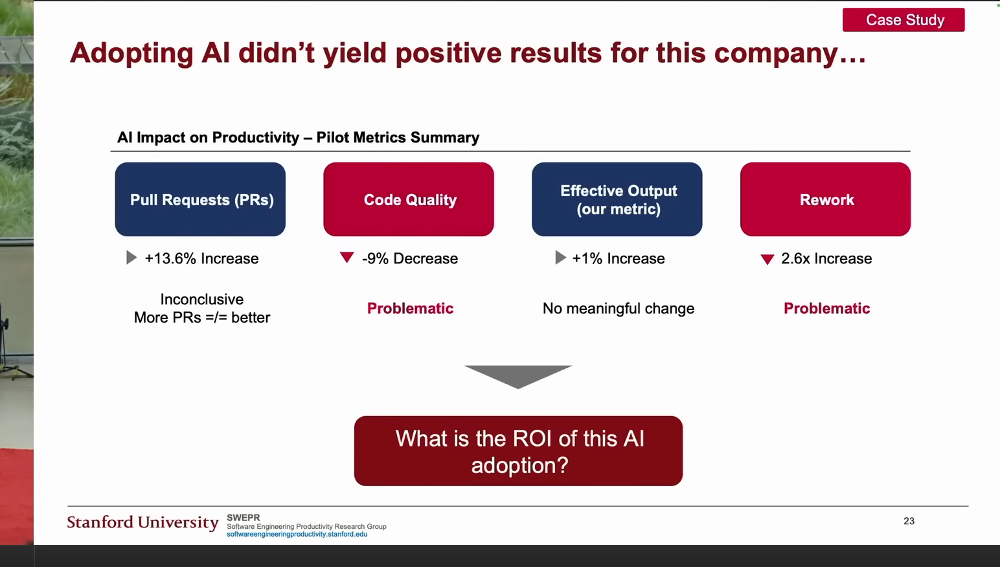
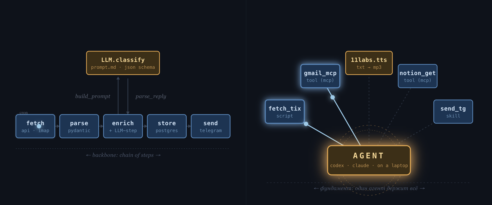

### AI-native SDLC. Грабли, на которые почти все наступают

Template: `./assets/template-face.svg`

Николай Шейко

- Кастомная ИИ разработка: [grably.tech](https://grably.tech)
- Топовые онлайн конфы по ИИ: [entropy.talk](https://entropy.talk)
- Курс по агентам: [aiforwork.courses](https://aiforwork.courses)

Канал: [AI и грабли](https://t.me/ai_grably)

---

### План

1. что уже происходит с SDLC
2. топ ошибок при внедрении ИИ
3. лайфхаки и best-practices
4. что ждет завтра (и как готовиться)

### Тренды прошлого

1. METR: ощущения ускорения 20%, реальность -20%

[METR, июль 2025](https://arxiv.org/pdf/2507.09089)

---

### Тренды прошлого

1. METR: ощущения ускорения 20%, реальность -20%
2. SWEPR: ускорение есть и разрыв растет

[SWEPR / Stanford, август 2025](https://aiconference.com/wp-content/uploads/2025/09/Yegor-Denisov-Blanch-Will-AI-Replace-Software-Engineers_-.pptx.pdf)

---

### Тренды прошлого

1. METR: ощущения ускорения 20%, реальность -20%
2. SWEPR: ускорение есть и разрыв растет
3. Karpathy: Агенты заработали

[Karpathy про декабрь 2025](https://x.com/karpathy/status/2026731645169185220)

---

### Тренды прошлого

1. METR: ощущения ускорения 20%, реальность -20%
2. SWEPR: ускорение есть и разрыв растет
3. Karpathy: Агенты заработали
4. Boris Tane: SDLC мертв

[Boris Tane: The Software Development Lifecycle is Dead](https://boristane.com/blog/the-software-development-lifecycle-is-dead/)

---

### Тренды прошлого

1. METR: ощущения ускорения 20%, реальность -20%
2. SWEPR: ускорение есть и разрыв растет
3. Karpathy: Агенты заработали
4. Boris Tane: SDLC мертв
5. Review - главный bottleneck

[Boris Tane: Review Curse](https://boristane.com/blog/the-software-development-lifecycle-is-dead/)

---

### Распределение времени

---

### Суммируем

- Проблемы с оценкой эффективности
- Объективно - результат был даже летом 2025
- Схлопывание этапов разработки

---

### Ошибка 1. Работа в синхронном режиме

Developer vs Engineering Manager
(CPU-bound vs IO-bound)

---

### Кейс 1: Перенос фронтенда на новый стек

- Компания оплачивает ИИ для команды
- Команда пользуется, но кто как умеет, централизированной настройки почти нет
- Перевозят фронт на новый стек, хотят ускорить за счет ИИ, заодно прокачаться

---

### Какое необходимое условие успеха с AI в разработке?

---

### Ошибка 2. Feedback Loop

- Агент пишет код
- Тестит человек в браузере

Решение: агент сравнивает старый и новый фронт

---

### Ошибка 3. Слишком мало времени на планирование

- Команда вайбкодит в режиме кранча
- Потом архитектурные проблемы, которые блочат разработку
- Код возвращается на доработку, вся продуктивность съедается

Решение:
- Планирование занимает несколько часов
- Агент в один заход делает реализацию

---

### Ошибка 4. Использовать устаревшие инструменты

- Используют Cursor
- Платят за токены

Решение:
- Codex / Claude Code

---

### Первые попытки

- Cursor -> Claude Code
- Опросник для команды (для CLAUDE.md)
- Замыкание Feedback Loop (линтер, typescript, тесты, playwright)
- Участие в синках, корректировка решений команды

---

### Ошибка 5. Пытаться пушить сразу всех

- Проблема 1: разная степень сопротивления
- Всегда есть те, кто готов пробовать новое, и те, кто будет до последнего относиться скептически
- Гораздо эффективнее прокачать тех, кто готов, чтобы они потом заражали коллег

---

### Ошибка 5. Разная степень "ИИ-нативности"

- Не все, кто "хочет" пробовать новое, на самом деле подходят для этого
- Раньше нас ценили за возможность забуриться в проблему и сконцентрированно решать ее
- Сейчас это может делать ИИ, а нам нужно стать асинхронными менеджерами
- Важно выбрать людей, у которых есть нативные черты асинхронного менеджера

---

### Ошибка 6. Учить пользоваться ИИ на примере переноса фронта на новый стек

Плюсы:

- Можно граундиться об старую реализацию
- Все edge cases уже известны

Минусы:

- Тащим старые костыли
- Очень много архитектурной работы

---

### Решение

1. Видео, где я сам реализую одну фичу
2. Скрипт выгрузки сессий Claude Code
3. Отсматриваю вместе с codex
4. Пишу фидбэк и планы для команды
5. Фокус на двух топ-перформерах

---

### Кейс 2: Аудит процессов в команде

- Европейский аутсорс
- Успехи есть, хотят больше

---

### Смотрим метрики

---

### Что показывают метрики?

1. Работы больше
2. Доработок тоже

---

### Ошибка 7. Считать не те метрики

Плохо:

- LOC
- Число коммитов
- Число PR
- Скорость выкатки фичей

---

### Хорошие метрики

Хорошо:

- Количество выполненных задач на единицу времени
- Задача выполнена, если не возвращается на доработку

Доп:

- Время жизни задачи
- Количество доработок
- Время на доработке

---

### Что узнали?

PR-ов много, но ревью все тормозит

---

### Ошибка 8. Делать ревью вручную

- Ревью становится боттлнеком
- Либо тормозит процесс, либо снижается качество

Решение:
- Делать **вместе** с агентом
- Хак: представьте, что он студент, который сдает вам экзамен

---

### Кейс 3: Большая кодовая база

Проклятье compaction

---

### Проклятье compaction

Агент упирается в лимит, делает compaction и пока восстанавливает контекст снова упирается в лимит

---

### Ошибка 9. Забивать на лучшие практики разработки

Протекшие абстракции -> агенту нужно много контекста.

Решение:
- Деды придумали best practices
- Loose Coupling, High Cohesion
- Для выполнения задачи не нужен весь контекст
- Альтернатива: следить за индексом документации

---

### Еще "забавные" кейсы-ошибки

- Миддл упоролся и выстроил весь AI SDLC в компании
- Ему отказались повышать зп на 50к
- **Итог:** ушел в другую компанию на 150к+

---

### Еще "забавные" кейсы-ошибки

- Стартап пытался в spec-driven девелопмент
- Когда получали результат, все переделывали
- **Итог:** сначала прототип, потом уже спека

---

### Что ждем завтра?

тренды vs хайп

---

### Продакт-инженер

Быть просто разработчиком уже нельзя

Для Plan и Review нужно понимание продукта

"Я просто делаю тикеты" теперь может ИИ-агент

---

### Intelligence vs Judgement

У ИИ - усредненный вкус

Доменная экспертиза

ИИ может сделать сотней способов, нужно подсказать, каким именно подходит в нашем специфичном контексте

---

### Две роли

**Agentic Engineer**

- Оунит конкретную задачу
- Планирует, запускает агентов, валидирует результат
- Отвечает за продуктовый смысл и качество

**Agentic Operations**

- Оунит систему разработки
- Поддерживает skills, инструменты, шаблоны, метрики
- Убирает боттлнеки из SDLC

---

### Токены дорожают

---

### Agent Evolution

1. Проводим агента за ручку по задаче (онбординг)
2. "Оформи это в скилл" (документация для следующих новичков)
3. Напарываемся на новые проблемы
4. "Обнови скилл"

---

### Сдвиг парадигмы разработки

[Подробнее](https://slides.grably.tech/agent-paradigm-layers.html)

---

### Итоги: Ошибки разработчика

1. Считать себя исполнителем (нужно – менеджером)
2. Забивать на SOLID, etc (принципы "локализации работы")
3. Работать без замкнутого Feedback Loop (стат. анализ, тесты, e2e)
4. Делать кодревью вручную (делаем ревью с агентом)

---

### Итоги: Ошибки разработчика

5. Тратить слишком мало времени на планирование ()
6. Тратить слишком много времени на планирование (когда не знаем, что хотим – быстрее сделать и выкинуть)
7. Использовать все фичи (AGENTS.md → skills → subagents → specialized agents)
8. Забивать на эволюцию (постепенный онбординг агента через пробы и ошибки)

---

### Итоги: Ошибки компании

1. Нанять внешнего настройщика (нужно препода/куратора)
2. Начинать с задач с большой ценой ошибки (нужно: дашборды, админки, автоматизация)
3. Использовать устаревшие инструменты (нужно codex / claude code)
4. Пытаться пушить всех сотрудников (вам нужна пара энтузиастов на команду)

---

### Итоги: Ошибки компании

5. Не повышать зп (они скоро осознают свою ценность)
6. Надеяться на быстрый результат (для старта – 50+ часов **обучения**)
7. Нанимать по старому (нужно: смотреть как используют свой сетап)
8. Считать метрики типа LOC, commits, PRs (нужно: поток задач до финала)

---

### Итоги: Чего ждать?

- Две роли:
  - Agentic Engineer (оунит задачки)
  - Agentic Operations (оунит SDLC)
- Рост цены токенов
- ИИ-агенты вне разработки
- Найм/увольнение зависит от владения ИИ

---

### Итоги: Что делать?

**Долгосрок:**

- Попробуйте стать "чемпионом внутри команды" (оунить SDLC)
- Вкатываться сейчас, пока подписки еще +- жирные
- Стараться вытачивать систему до one-shot
- Автоанализ сессий на уровне команды (а-ля ретро)

---

### Итоги: Что делать?

**Короткосрок:**

- Замкните Feedback Loop (статик анализ, тесты – unit/e2e, manual-e2e)
- Напишите скилл, который анализирует сессии за день
- Скачать wisprflow/handy (или хоткей в codex)

---

### Еще один важный пункт

Не напрягайтесь слишком сильно из-за новых инструментов

Самое важное само вас найдет. А еще обязательно встроится в Codex и Claude Code.

Примеры - dispatch, memory, skills, todolist, /goal (ralphloop), etc

---

### Финал

Template: `./assets/template-end-back.svg`

Проголосуйте за доклад

слайды: [slides.grably.tech/agentic_dev_conf](https://slides.grably.tech/agentic_dev_conf)

канал: [@ai_grably](https://t.me/ai_grably)

видео:

[Can you prove ROI in Software Eng (16 минут)](https://www.youtube.com/watch?v=JvosMkuNxF8)

[Куда двигается найм (1,5 часа)](https://www.youtube.com/live/y2NnheH1-eU)

[Как не просрать карьеру в эпоху ИИ (18 минут)](https://www.youtube.com/watch?v=AW4gLWLrzcw)
