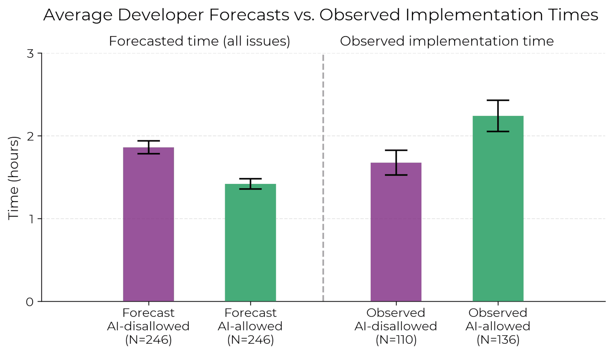
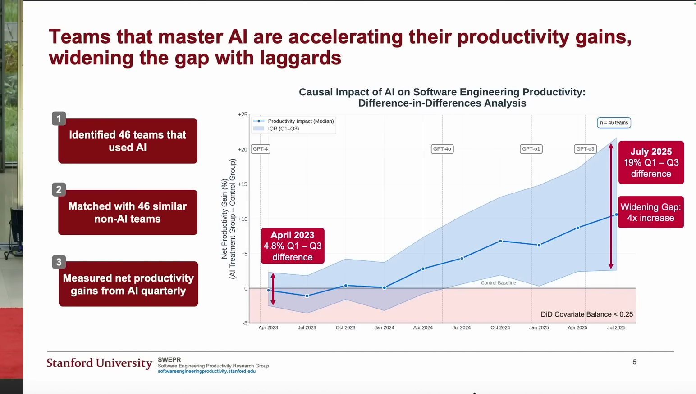
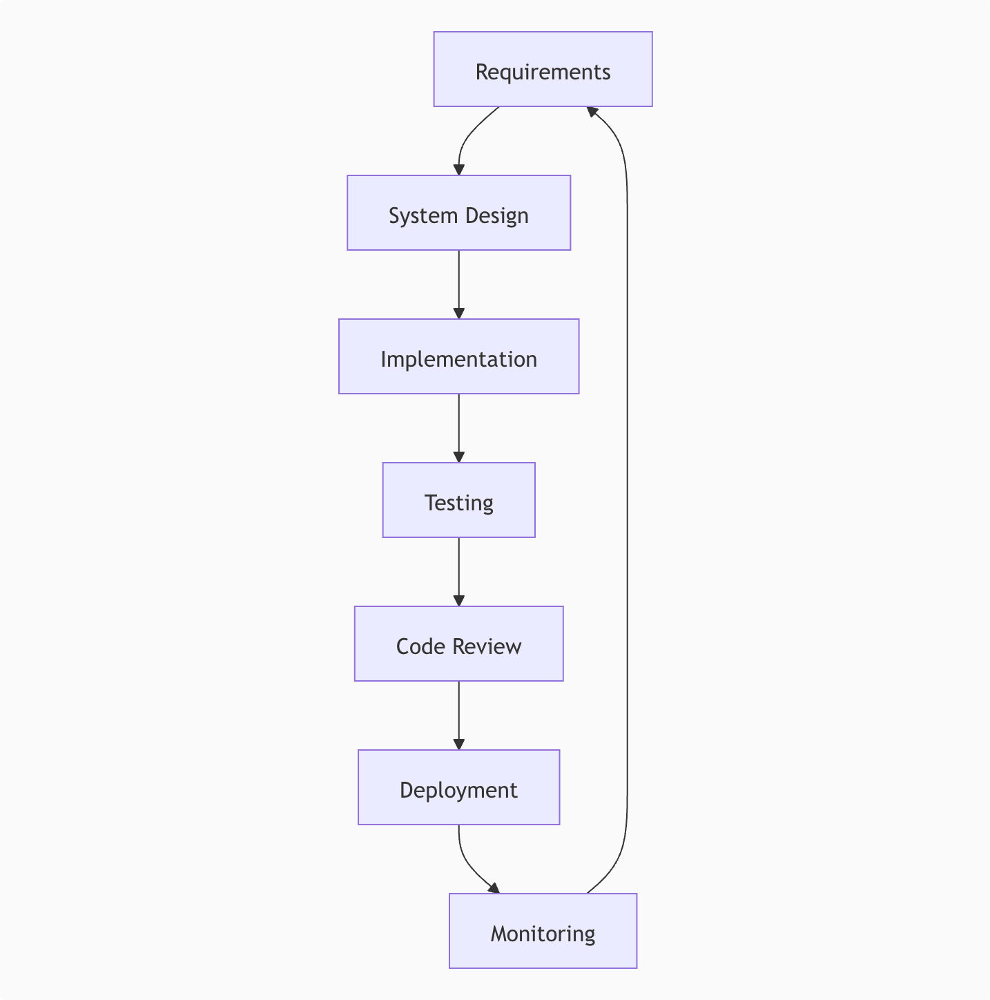
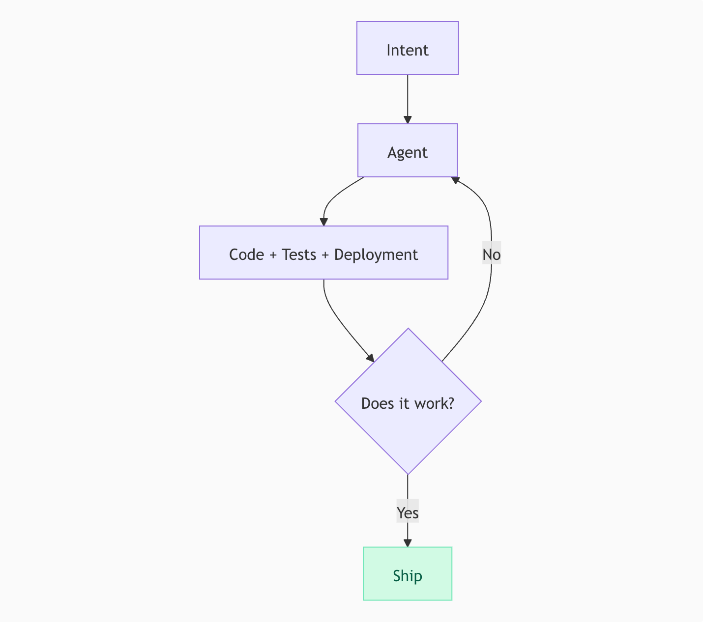
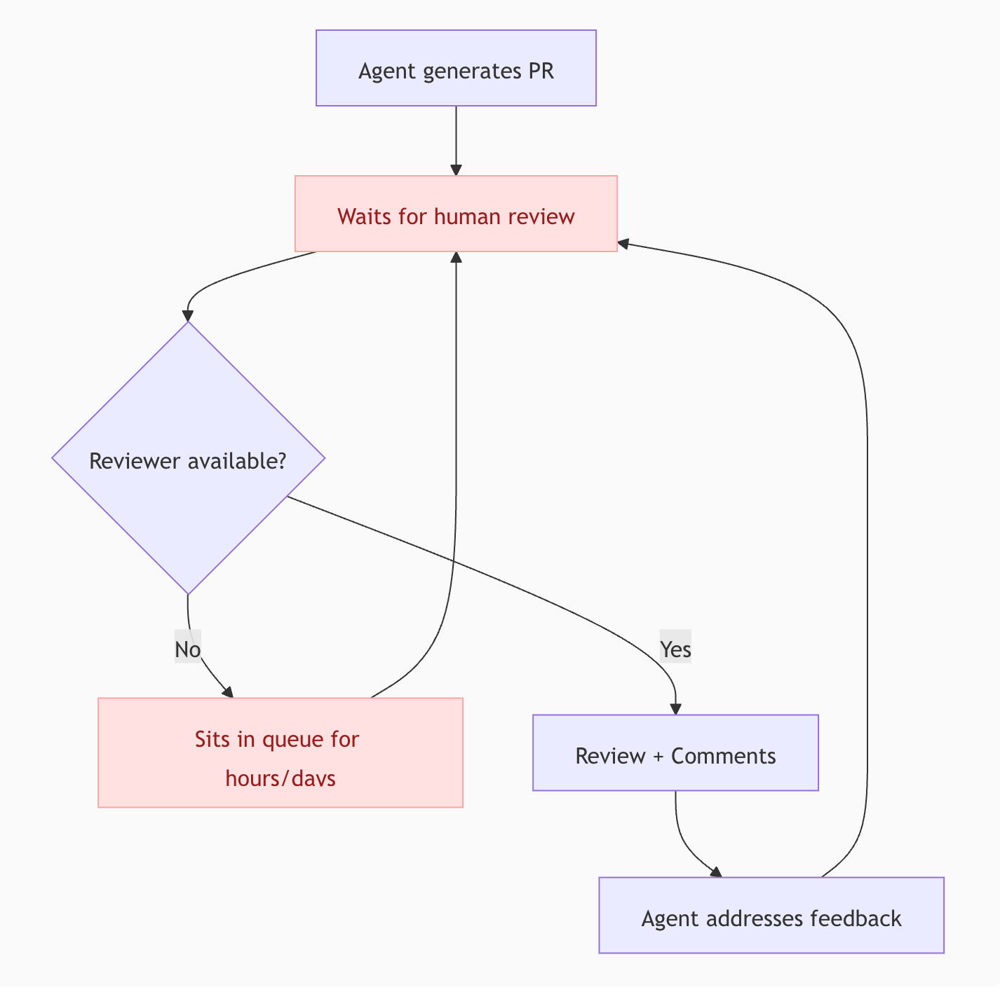
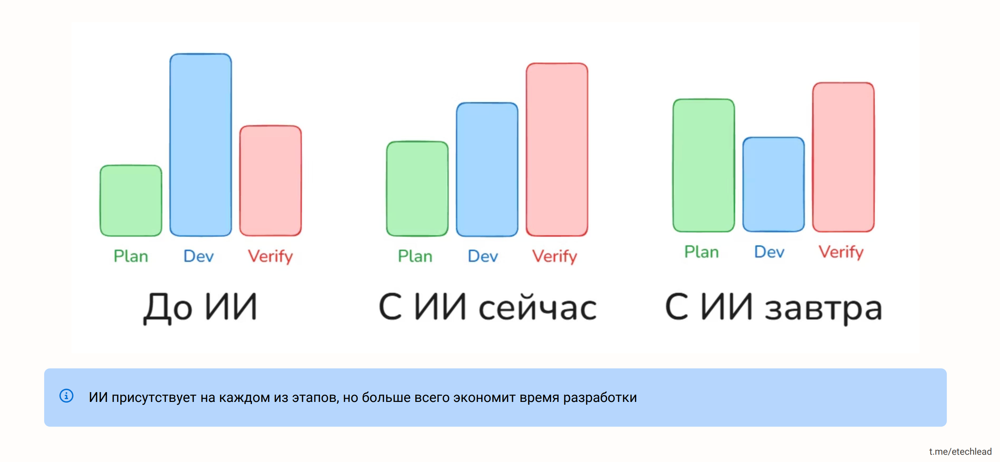
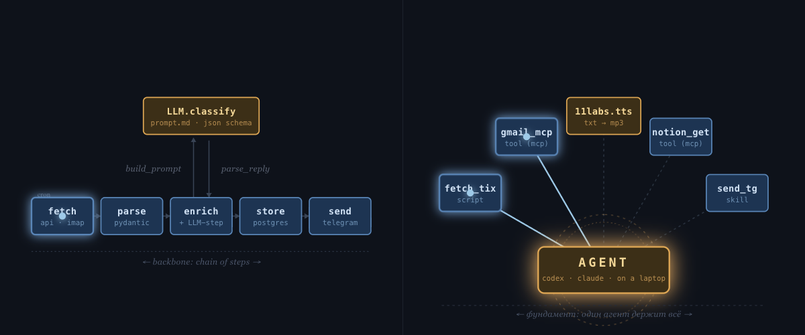

[Презентация  
со ссылками](https://slides.grably.tech/devfest/)

### AI-native SDLC. Грабли, на которые почти все наступают

Николай Шейко

- Кастомная ИИ разработка: [grably.tech](https://grably.tech)
- Топовые онлайн конфы по ИИ: [entropy.talk](https://entropy.talk)
- Курс по агентам: [aiforwork.courses](https://aiforwork.courses)
- Личный опыт, факапы, туториалы: [@ai_grably](https://t.me/ai_grably)

### План

1. что уже происходит с SDLC
2. топ ошибок при внедрении ИИ
3. лайфхаки и best-practices
4. что ждет завтра (и как готовиться)

### Июль 2025. Исследование METR

[Measuring the Impact of Early-2025 AI on
Experienced Open-Source Developer Productivity](https://arxiv.org/pdf/2507.09089)

1. ИИ **мешает** в разработке
2. А разработчики **думают**, что помогает

### Август 2025. Исследование SWEPR (Stanford)

[Will AI Replace
Software Engineers?](https://aiconference.com/wp-content/uploads/2025/09/Yegor-Denisov-Blanch-Will-AI-Replace-Software-Engineers_-.pptx.pdf)

1. На самом деле помогает
2. Но разрыв между топ-перформерами и остальными – огромный

### Декабрь 2025

Выход Claude Opus 4.5 и GPT-5.2

[Karpathy про декабрь](https://x.com/karpathy/status/2026731645169185220)

### Март 2026. SDLC is dead

  
  

[Boris Tane: The Software Development Lifecycle is Dead](https://boristane.com/blog/the-software-development-lifecycle-is-dead/)

---

### Март 2026. SDLC is dead

Review Curse

---

### Распределение времени

---

### Суммируем

- Проблемы с оценкой эффективности
- Объективно – результат был даже летом 2025
- Схлопывание этапов разработки

---

### Ошибка 1. Работа в синхронном режиме

Developer vs Engeneering Manager
(CPU-bound vs IO-bound)

<!-- Картинка последовательных блоков и картинка когда асинхронно в разные стримы дает апдейты. можно даже запустить анимацию на ней -->

---

### Кейс 1: Перенос фронтенда на новый стек

- Компания оплачивает ИИ для команды
- Команда пользуется, но кто как умеет, централизированной настройки почти нет
- Перевозят фронт на новый стек, хотят ускорить за счет ИИ, заодно прокачаться

---

### Какое необходимое условие успеха с AI в разработке?

> ожидаю четыре самых важных:
> фидбэк луп (техническое)
> Хорошая гегиена кода (техническое)
> Обучение команды (процессное)
> Эвалюейшн инструкций (процессное)

---

### Ошибка 2. Feedback Loop

Агент пишет код
Тестит человек в браузере

Решение

Агент сравнивает старый и новый фронт

### Ошибка 3. Слишком мало времени на планирование

Команда вайбкодит в режиме кранча
Потом архитектурные проблемы, которые блочат разработку
Код возвращается на доработку, вся продуктивность съедается

Решение

Норма:
1. Планирование занимает несколько часов
2. Агент в один заход делает реализацию

### Ошибка 4. Использовать устаревшие инструменты

Используют Cursor
Платят за токены

Решение

Codex / Claude Code

### Первые попытки

- Cursor -> Claude Code
- Опросник для команды (для CLAUDE.md)
- Замыкание Feedback Loop (линтер, typescript, тесты, playwright)
- Участие в синках, корректировка решений команды

---

### Что могло пойти не так?

#### Ошибка 5. Пытаться пушить сразу всех

Проблема 1: Разная степень сопротивления

> Всегда есть те, кто готов пробовать новое, и те, кто будет до последнего относиться скептически. Гораздо эффективнее будет прокачать тех, кто готов, чтобы они потом заражали своих коллег, чем самому пробиваться через стену недоверия

Проблема 2: Разная степень "ИИ-нативности"

> Тут важно, что не все, кто "хочет" пробовать новое, на самом деле подходят для этого. Тут есть в целом очень большая проблема у айтишников, что нас всю дорогу ценили за возможность забуриться в проблему и сконцентрированно решать ее. Такая, блокирующая работа. А сейчас оказалось, что ее может делать ИИ, и нам всем нужно резко стать асинхронными менеджерами. И многим тяжело. Важно выбрать людей, у которых есть нативные черты асинхронного менеджера.

---

### Что могло пойти не так?

#### Ошибка 6. Учить пользоваться ИИ на примере переноса фронта на новый стек

Плюсы:

- Можно граундиться об старую реализацию
- Все edge cases уже известны

Минусы:

- Тащим старые костыли
- Очень много архитектурной работы

---

### Решение

1. Видео, где я сам реализовываю одну фичу
2. Скрипт выгрузки сессий Claude Code
3. Отсматриваю вместе с codex
4. Пишу фидбэк и планы для команды
5. Фокус на двух топ-перформерах

---

### Кейс 2: Аудит процессов в команде

- Европейский аутсорс
- Успехи есть, хотят больше

---
### Кейс 2: Аудит процессов в команде

Смотрим метрики

Работы больше
Доработок тоже

---

### Ошибка 7. Считать не те метрики

Плохо:
- LOC
- Число коммитов
- Число PR
- Скорость выкатки фичей

Хорошо:
- Количество выполненных задач на единицу времени
  - Задача выполнена, если не возвращается на доработку
Доп:
- Время жизни задачи
- Количество доработок
- Время не доработке

---

### Что узнали?

PRов много, но ревью все тормозит

---

### Ошибка 8. Делать ревью вручную

Ревью становится боттлнеком
Либо тормозит процесс, либо снижается качество

Решение

Делать **вместе** с агентом
Хак: представьте, что он студент, который сдает вам экзамен

---

### Кейс 3: Большая кодовая база

Проклятье compaction

Агент упирается в лимит, делает compaction и пока восстанавливает контекст снова упирается в лимит

---

### Ошибка 9. Забивать на лучшие практики разработки

Протекшие абстракции → Агенту нужно много контекста

Решение

Деды придумали best practices
Loose Coupling, High Cohesion
Для выполнения задачи не нужен весь контекст

Альтернатива: следить за индексом документации

---

---

> AI-кодинг — это навык. Такой же навык, как программирование... И все навыки, они имеют кое-что общее: чтобы научиться их применять, их следует целенаправленно прокачивать. Вы, конечно, можете ждать, что люди вдруг сами освоят необходимые навыки без чьей-либо помощи, но обычно это не происходит

> AI-кодинг — это своего рода новый язык программирования... научиться говорить на иностранном языке просто невозможно, если всё время молчать... Только сделав тысячу запросов, можно понять, как это на самом деле работает

### Еще "забавные" кейсы-ошибки

Миддл упоролся и выстроил весь AI SDLC в компании
Ему отказались повышать зп на 50к
**Итог:** ушел в другую компанию на 150к+

Стартап пытался в spec-driven девелопмент
Когда получали результат, все переделывали
**Итог:** сначала прототип, потом уже спека

---

### Что ждем завтра?

тренды vs хайп

---

### Продакт-инженер

Быть просто разработчиком уже нельзя

Для Plan и Review нужно понимание продукта

"Я просто делаю тикеты" теперь может ИИ-агент

---

### Intelligence vs Judgement

У ИИ – усредненный вкус
Доменная экспертиза = ценность

> ИИ может сделать сотней способов, нужно подсказать, каким именно подходит в нашем специфичном контексте

---

### Agent Evolution

1. Проводим агента за ручку по задаче (онбординг)
2. "Оформи это в скилл" (документация для следующих новичков)
3. Напарываемся на новые проблемы
4. "Обнови скилл"

---

### Сдвиг парадигмы разработки

[Подробнее](https://slides.grably.tech/agent-paradigm-layers.html)

---

### Итоги: Ошибки разработчика

1. Считать себя исполнителем (нужно – менеджером)
2. Забивать на SOLID, etc (принципы "локализации работы")
3. Работать без замкнутого Feedback Loop (стат. анализ, тесты, e2e)
4. Делать кодревью вручную (делаем ревью с агентом)

### Итоги: Ошибки разработчика

5. Тратить слишком мало времени на планирование ()
6. Тратить слишком много времени на планирование (когда не знаем, что хотим – быстрее сделать и выкинуть)
7. Использовать все фичи (AGENTS.md → skills → subagents → specialized agents)
8. Забивать на эволюцию (постепенный онбординг агента через пробы и ошибки)

### Итоги: Ошибки компании

1. Нанять внешнего настройщика (нужно препода/куратора)
2. Начинать с задач с большой ценой ошибки (нужно: дашборды, админки, автоматизация)
3. Использовать устаревшие инструменты (нужно codex / claude code)
4. Пытаться пушить всех сотрудников (вам нужна пара энтузиастов на команду)

### Итоги: Ошибки компании

5. Не повышать зп (они скоро осознают свою ценнсть)
6. Надеятся на быстрый результат (для старта – 50+ часов **обучения**)
7. Нанимать по старому (нужно: смотреть как используют свой сетап)
8. Считать метрики типа LOC, commits, PRs (нужно: проток задач до финала)

### Две роли

**Agentic Engineer**

- Оунит конкретную задачу
- Планирует, запускает агентов, валидирует результат
- Отвечает за продуктовый смысл и качество

**Agentic Operations**

- Оунит систему разработки
- Поддерживает skills, инструменты, шаблоны, метрики
- Убирает боттлнеки из SDLC

### Токены дорожают

4 месяца назад  
Подписка OpenAI 20 баксов = ∞

### Итоги: Чего ждать?

- Две роли:
  - Agentic Engineer (оунит задачки)
  - Agentic Operations (оунит SDLC)
- Рост цены токенов
- ИИ-агенты вне разработки
- Найм/увольнение зависит от владения ИИ

### Итоги: Что делать?

**Долгосрок:**

- Попробуйте стать "чемпионом внутри команды" (оунить SDLC)
- Вкатываться сейчас, пока подписки еще +- жирные
- Стараться вытачивать систему до one-shot
- Автоанализ сессий на уровне команды (а-ля ретро)

### Итоги: Что делать?

**Короткосрок:**

- Замкните Feedback Loop (статик анализ, тесты – unit/e2e, manual-e2e)
- Напишите скилл, который анализирует сессии за день
- Скачать wisprflow/handy (или хоткей в codex)

### Еще один важный пункт

Не напрягайтесь слишком сильно из-за новых инструментов

> самое важное само вас найдет. А еще обязательно встроится в Codex и Claude Code
> Примеры – dispatch, memory, skills, todolist, /goal (ralphloop), etc

### Доп материалы

- [Can you prove ROI in Software Eng (16 минут)](https://www.youtube.com/watch?v=JvosMkuNxF8)
- [Мок-собеседование на agentic engineer (час + 30 минут)](https://www.youtube.com/watch?v=7bOSq-drD5A)
- [Куда двигается найм (1,5 часа)](https://www.youtube.com/live/y2NnheH1-eU)
- [Как не просрать карьеру в эпоху ИИ (18 минут)](https://www.youtube.com/watch?v=AW4gLWLrzcw)

### Топ каналы

- @the_ai_architech
- @etechlead
- @ai_grably

### Вопросы?

- Нужно ли знать, как ИИ работает под капотом?
- Грин и ред флаги на собесе?
- Где главный боттлнек в SDLC?
- А если модельки станут умнее, планирование тоже уйдет?
