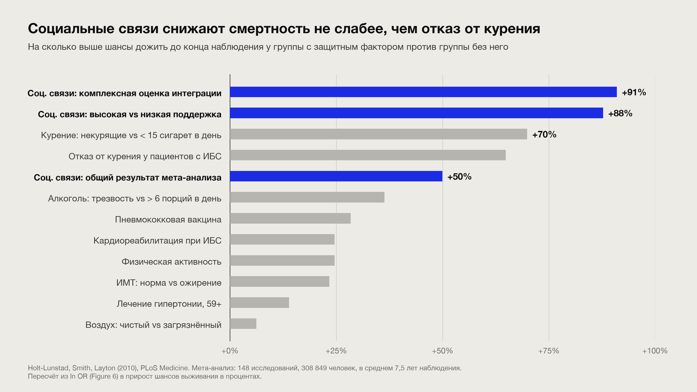

# Неденежный капитал: почему на пенсии он важнее денег

"Сотни незаписанных интервью"

> Тут я говорю про то, что в юности много путешествовал автостопом по РФ, Европе, Африке, Латинской Америке и Азии. Видел очень разных людей и смог пообщаться и сформировать какую-то картину старости и того, что там важно

---

## 1. Капитал ≠ деньги

- В 30 деньги меняются на время, здоровье, обучение, связи
- В 70 деньги почти не покупают здоровье, друзей, уважение, смысл
- Здоровье и связи — неликвид: нельзя купить срочно, только накопить заранее

---

## 3. Здоровье (healthspan, не lifespan)

- "Мочь то, что хочешь" вместо "жить дольше"
- Сила, мышечная масса, VO2max предсказывают смертность лучше большинства анализов
- Дёшево сейчас, недоступно потом: слух, зубы, зрение, сон

---

## 4. Мозг: fluid падает, crystallized растёт

- Fluid intelligence (скорость, новые задачи) снижается с ~30
- Crystallized (синтез, суждение, паттерны) растёт до 60–70
- Вторая половина карьеры должна ехать на crystallized
- Когнитивный резерв: языки, музыка, сложные хобби с сообществом

> Arthur Brooks, «From Strength to Strength». Это научная база под всё, что дальше про оракула: старение — не деградация, а смена типа интеллекта. Проблема в том, что карьеры построены на fluid, и люди пытаются на нём же ехать в 55, проигрывают тридцатилетним и ломаются. Надо вовремя пересесть.

---

## 5. Социальные связи

- Сильные связи: кто приедет в 3 ночи, у кого ключи, кто emergency contact
- Слабые связи: оттуда приходят проекты и работа
- Третье место: не дом и не работа, где тебя ждут по умолчанию

> Разложить на слои, потому что люди путают «много знакомых» с «есть кому позвонить». Проверочный вопрос в зал: назовите 5 человек, которые приедут в 3 ночи. Слабые связи — отдельный тезис: интересные проекты в старости приходят не от друзей, а от полузнакомых. Моаи — пример, что в Blue Zones это институт, а не случайность, у нас его надо строить руками.

---

## 6. Связи протухают

- Дружба деградирует без контакта за несколько месяцев (Данбар)
- Годовое письмо ученикам/подчиненным, office hours для бывших студентов
- Совместные дела сближают сильнее всего (горы, фестивали, хакатоны, путешествия, коливинг)

> Личная история: мои студенты, для которых я был наставником и которые меня любили, я с ними почти не общаюсь. Это потерянный актив, причём потеря незаметная, как инфляция. Упор на механику: связи не поддерживаются намерением, только календарём. Лучший формат контакта — совместное дело, не переписка.

---

## 7. Межпоколенческие инвестиции

- Дети — не единственный "младший" актив. Ученики, джуны, менторство
- Reverse mentoring (прокачивает judgement)
- Не ожидать возврат, но не терять контакт

> Эриксон: стадия generativity vs stagnation, забота о следующем поколении как источник смысла в поздней жизни. Ученики — генеративность вне семьи, тот же психологический механизм. Adam Grant, «Give and Take»: giver'ы с границами выигрывают на длинной дистанции. Честно сказать: поддержка от учеников будет меньше, чем от детей, но она есть и она через проекты, а не через деньги. И это единственный капитал, который растёт сам, пока ты спишь, если его не бросать.

---

## 8. Предел "некомпетентности"

- Сложность задачи, которую решит организация, ограничена компетентностью лучшего сотрудника
- Сто мидлов не решают задачу одного сеньора
- Старых держат не за работу, а чтобы они объяснили, как решать
- Делает молодежь, но без "деда" задача не решилась бы вовсе

---

## 9. Планки: high-water mark остаётся навсегда

- Управлял $1M, 200 людьми, продуктом на миллион юзеров — это необратимо
- Рынок смотрит на максимум, не на среднее и не на текущее
- Планки не суммируются: один раз до 200 лучше, чем десять раз до 20
- Новая планка открывает новый горизонт мышления

> Термин из финансов буквально: high-water mark. Факт достижения доказывает две вещи: умеешь и тебя туда пустили. Второе иногда важнее: кто-то уже принял на тебя риск, следующему легче. Ловушки: планка должна быть проверяемой, фальшивая хуже отсутствующей; спуск после пика нормален, лычка остаётся. Связь с оракулом: к тебе приходят спрашивать именно потому, что «он это уже делал на масштабе».

---

## 10. Репутация конвертируется в деньги. А обратно?

> капитал = деньги x компетенция x ресурсы (с) Миша Токовинин

- Деньги легко получить, если есть репутация: компетенция + предсказуемость + этический компас
- Строится годами, легко теряется
- Единственная репутация, нужная с первого дня: "делает, что обещал"

Но есть еще всякие лычки: личный бренд, публикации, awards, соцсети, сообщества

---

## 11. Иногда репутация – это плохо

- Репутация ограничивает – сложно публично косячить
- Делать плохо — критический навык: стартап, бизнес, новая область
- Поиск решается перебором вариантов. Вылизывать каждый = перебрать мало
- "Никто и звать никак" – привилегия

> Контринтуитивный тейк, зал проснётся. Стартап — это не поиск качественного решения, а поиск правильной задачи; качество на этапе поиска тратит ограниченный ресурс попыток. Как не быть заложником образа: раздельные идентичности (серьёзное имя и песочница без имени), явно объявленные эксперименты («это прототип, будет плохо»), или строить репутацию «человека, который быстро пробует», она защищает сама. Уточнить: не строить рано стоит репутацию эксперта и перфекциониста, а не репутацию «делает, что обещал».

---

## 12. Собираем в кучку

- Молодость: быть никем, делать плохо, пробовать, собирать опыт – разбираться, что нравится делать и как строить отношения
- Середина: пробивать планки, пока есть fluid intelligence и дают шанс
- Поздно: жить на репутации, планках и учениках

## 13. Своевременность. Всему в жизни есть свой "слот"
