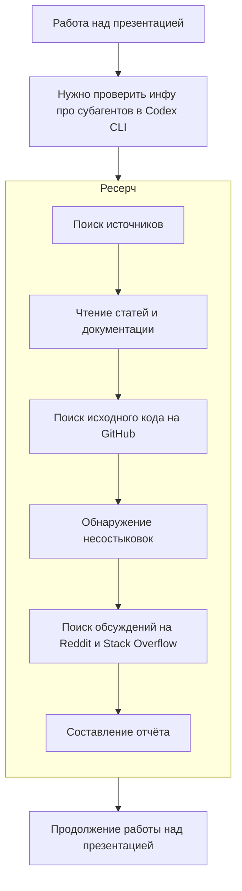
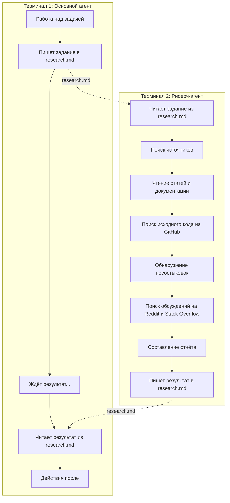
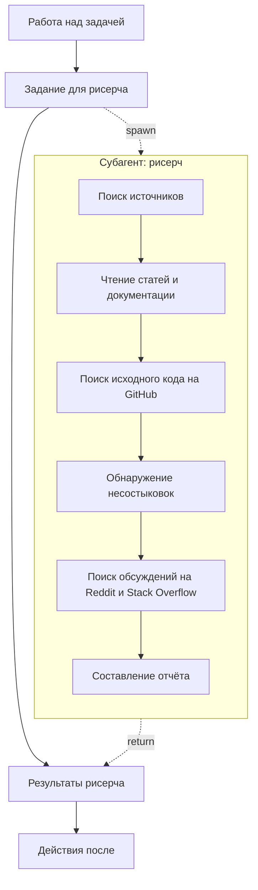

---

### Николай Шейко | Строим команду ИИ-агентов

- Раньше AI Engineer в US HRTech
- Делаю кастомные ИИ инструменты для нейатешного бизнеса
- Для айтишного – обучаю команды использовать AI в разработке
- Организовываю AI конфы (entropy.talk)
- Пишу в AI и грабли ([@ai_grably](https://t.me/ai_grably))

---

> Вчера увидел эту картинку и решил добавить ее в презу. В agent-swarms (перекрестные связи между агентами) я пока не верю – оставим это для хайпа в твиттере. Но сегодня мы вручную пройдем с 5 до 7 уровня и немного его оптимизируем, потому что 10 табов в терминале сжигают мозг примерно за час работы в лучшем случае.


---

> Правда, мне кажется, что 7 картинка - бред. В реальности там должно быть что-то такое. Вот какая должна быть на самом деле. Можно так же в 2-3 терминалах параллельно.


---

## Общие тренды

- Переход от копайлота к ИИ-работникам, работающим автономно
  > тут сказать про превращение человека в один из инструментов агента
- Разделение ролей
  > тут сказать про bias и про то как сложно совмещать роль менеджера и исполнителя. Или маркетолога и разработчика.
- **Пруфы:** новые анонсы субагентов в Codex, параллельных агентов в Claude Code, Cursor, Agent Teams в Claude Code и Kimi

---

## Практика

Нам нужно собрать данные про субагентов в Codex CLI. В процессе агент ищет исследования, читает документацию, собирает метрики и данные.

> Демо: показываю, как claude code выполняет сбор данных про субагентов в Codex CLI

---

### Как выглядит флоу работы над презентацией



---

### Проблема контекстного окна

- График про ухудшение работы с ростом окна


"контекст нужно рассматривать как ограниченный ресурс с убывающей предельной отдачей." (c) Anthropic

> Даже с увеличением макс контекста модели, проблема остается. 1m не спасает (попробуйте gemini, lol)

---

### И еще один важный факт


### Решение 1: Два независимых агента

Запускаем два CLI параллельно. Синхронизация через MD-файл: один агент пишет результаты рисерча, другой читает.



> **Демо:** запускаем два терминала с Claude Code. Показываю ручную синхронизацию через файл.

**Минусы:** ручная работа, нужно следить за двумя окнами, копировать контекст.

> В таком флоу мы становимся еще более тупым инструментам модели

### Решение 2: Субагенты

Основной агент сам запускает рисерч в отдельном треде и получает только результат.



> **Демо:** тот же запрос, но теперь через Task tool с subagent_type. Агент сам делегирует и получает результат.

**Плюсы:** автоматизация, единый контекст, нет ручной синхронизации.

---

## Subagent vs Subtask

|  | Промпт | Тулы | Permissions | Spawn |
|--|--------|------|-------------|-------|
| **Subtask** | Общий | Все | Все | ✅ |
| **Subagent** | Кастомный | Кастомные | Кастомные | ❌ |

> Демо: запрос на рисерч реализации subagents в CC. Затем — создание специализированного read-only рисерч-агента.

**Важно:** чаще всего достаточно Subtask!

---

## Почему с появлением Skills субагенты почти не нужны

Субагенты = выбор динамического промпта в зависимости от задачи + тулы + subtask

- Первая часть заменяется скиллами
- Тулы перестали быть проблемой — context rot пофикшен новой реализацией Claude Code и уходом от MCP к Skills

**Вывод:** в большинстве случаев достаточно создать subtask с конкретным запросом на использование скилла.

### А если всё-таки нужен субагент?

Добавляем `context: fork` в SKILL.md:

```yaml
---
name: deep-research
description: Research a topic thoroughly
context: fork
agent: Explore
---

Research $ARGUMENTS thoroughly...
```

| Поле | Что делает |
|------|------------|
| `context: fork` | Запускает skill в субагенте |
| `agent: Explore` | Read-only агент для поиска |
| `allowed-tools` | Ограничить тулы |

> Демо: переносим рисерч из субагента в скилл, проверяем работу.

---

## Ralph Wiggum

```
while :; do cat prompt.md | agent ; done
```

Зацикливаем агента на автономную работу — наша задача стать тимлидом.

### Способы

1. **Через внешний скрипт** (про это расскажет Имя Фамилия завтра в Х времени)
2. **Через агента-оркестратора** — используем базового агента как менеджера, который следит, что всё выполнено и сам пинает "сотрудников"

### Идея

Забрать у себя возможность микроменеджить — ревьюим только итоговый результат.

### Без чего не заработает: качественные feedback loops

- Линтер
- Юнит-тесты
- e2e тесты (Playwright / Chrome DevTools)

### Подробнее в пт вечером

> Приходите подробнее слушать в пятницу вечером – будет отдельный доклад про это

---

## Как формировать роли в "команде"

> Отсылка к недавнему исследованию Cursor с имплементацией браузера.

[cursor.com/blog/scaling-agents](https://cursor.com/blog/scaling-agents)

**Базовый минимум:** разделяем роль менеджера и исполнителя

**Опционально:** добавляем ревьюера / тестировщика

**Основной тейк:** не переусложнять.

---

## Как ревьюить?

Так же как с людьми — ревьюим только PR, а не конкретные изменения или коммиты.

1. Сначала ревьюим с помощью агента `/review` (убирает bias имплементатора)
2. На практике это один из самых ROI-шных кейсов применения агентов на больших репо

---

## А где всё-таки субагенты нужны?

Когда нужны **кастомные Permissions**. Это не про инструменты, которые даём агенту, а про то, что ему запрещаем.

> Есть еще тейк про то, что пов

### Примеры

- QA-агент с Playwright MCP
- Deep Research agent из доки Антропиков
- Мультиагентная система с read-only оркестратором и исполнителями

### Закон Галла

> "Сложная система, которая работает, неизменно эволюционировала из простой системы, которая работала. Сложная система, разработанная с нуля, никогда не работает и не может быть исправлена, чтобы заработать. Нужно начинать сначала с работающей простой системы."

### Правильный флоу

1. Просто добавляем всё в единый `CLAUDE.md`
2. Постепенно выносим куски в отдельные Skills
3. Вызываем сабтаски вручную (промптом), пока не выведем успешные паттерны
4. **Только после этого** выносить в отдельные субагенты те части, где есть чёткие специализации по permissions *(и это опционально)*

**Главное:** гораздо важнее дать системе качественный feedback loop и уйти от микроменеджмента (Ralph Wiggum).

---


---

## Николай Шейко | Строим команду ИИ-агентов

Сравнение фичей сабагентов в Codex CLI, Claude Code, OpenCode


[t.me/ai_grably/123](https://t.me/ai_grably/123)

Скоро: RLM (memory layer) и Agents Teams в Claude Code

> Поддержка фичей разная в разных инструментах. Есть важные особенности типа того, кто поддерживает fork-контекст у скиллов, а кто позволяет запускать вложенных агентов. У меня есть про это хороший пост
> Еще интересно почитать про RLM и agents teams, можете поискать сами, а можете подписаться и дождаться поста про это

---

TODO:


1. Запустить DeepResearch Агента
2. Сказать, что subtask и subagent – это мое определение
3. "Используя Subtask и Subagents можно брать сильно большие таски, потому что мы не перполняем контекст"
4. Раскрыть, кто такие менеджеры и исполнители
5. Попробовать сделать рисерч по кодовой базе
